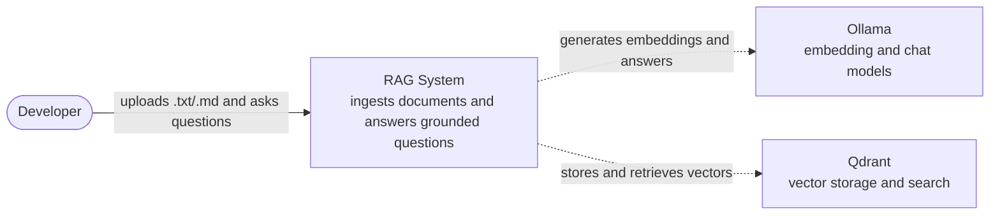
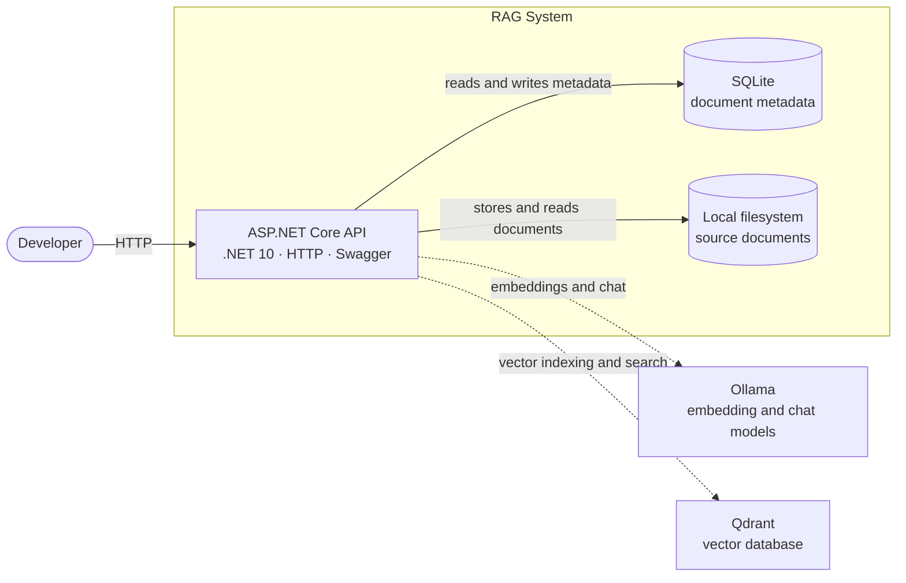
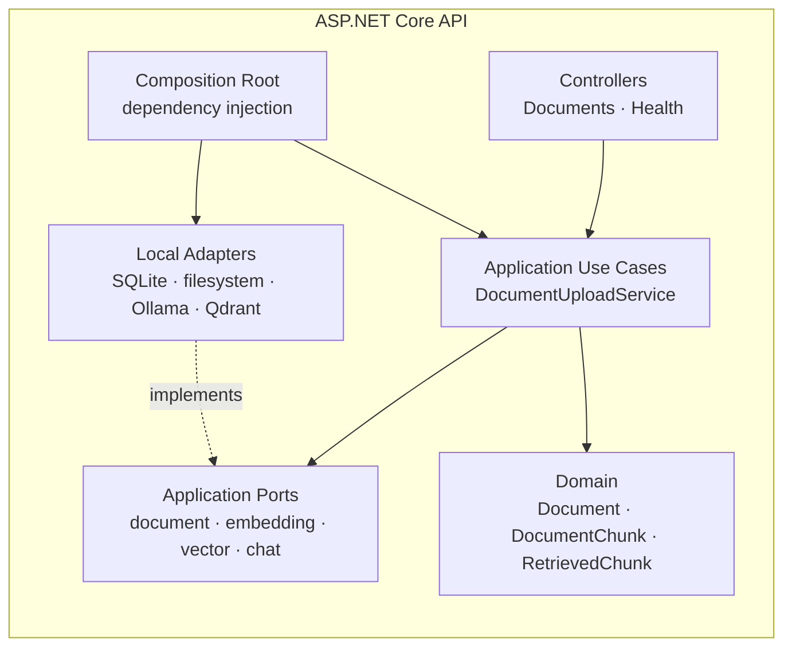

# Architecture

## Overview

This is a production-oriented RAG reference implementation in .NET 10. Milestone 1 runs entirely on a developer machine with Ollama and Qdrant. Milestone 2 replaces local adapters with Azure services without changing the Domain or Application layers.

The Application layer owns vendor-neutral interfaces. Infrastructure owns their implementations. The LLM never answers without relevant retrieved context.

## C1 — System Context

The developer uploads documents and asks grounded questions through the RAG system. Ollama provides local embedding and chat models. Qdrant provides vector storage and similarity search.



## C2 — Containers

The ASP.NET Core API exposes HTTP endpoints and acts as the dependency-injection composition root. SQLite stores document metadata, while the local filesystem stores uploaded source documents. Ollama and Qdrant are independently replaceable infrastructure.



## C3 — Components

Controllers translate HTTP requests into Application use cases. Use cases depend on ports owned by Application and operate on Domain concepts. Local adapters implement those ports without leaking vendor-specific types into Application.



Dashed arrows mark planned integrations or interface implementation. Solid arrows represent current calls or data access.

## Dependency Rule

Project references point inward. **Application never references Infrastructure.**

```text
Api → Application, Infrastructure.Local     (composition root wires both)
Infrastructure.Local → Application
Application → Domain
Domain → (nothing)
```

- `Rag.Domain` references no project.
- `Rag.Application` may reference only Domain.
- `Rag.Infrastructure.Local` may reference Application.
- `Rag.Api` may reference Application and Infrastructure.Local as the composition root.

At runtime, use cases depend on ports such as `IDocumentRepository`. The API registers adapters such as `SqliteDocumentRepository` through dependency injection, without Application knowing the concrete type.

## Important Architectural Flows

### Document ingestion

```text
Upload → Parse Markdown/Text → Chunk → Generate Embeddings → Store in Qdrant
```

Document metadata is persisted separately from source content and vectors. PDF ingestion is intentionally deferred.

### Grounded chat

```text
Question → Generate Query Embedding → Retrieve Relevant Chunks
         → Relevant context found? ── yes → Grounded LLM response
                                   └─ no  → Meaningful refusal
```

The LLM is never called to answer a domain question without retrieved context.

## Replaceable Infrastructure

- `IDocumentRepository`: SQLite in Milestone 1; replaceable in Milestone 2.
- `IDocumentFileStore`: local filesystem; replaceable with Azure Blob Storage.
- `IEmbeddingGenerator`: Ollama; replaceable with Azure OpenAI.
- `IVectorStore`: Qdrant; replaceable with Azure AI Search.
- `IChatCompletionService`: Ollama; replaceable with Azure OpenAI.

Semantic Kernel remains deferred unless it clearly simplifies orchestration.

## Cross-Cutting Concerns

- Structured logging uses `Microsoft.Extensions.Logging`.
- API errors use `ProblemDetails`.
- Readiness checks for SQLite and local storage are exposed at `/health`.
- Process liveness is exposed at `/health/live`.
- Swagger UI is enabled in Development.
