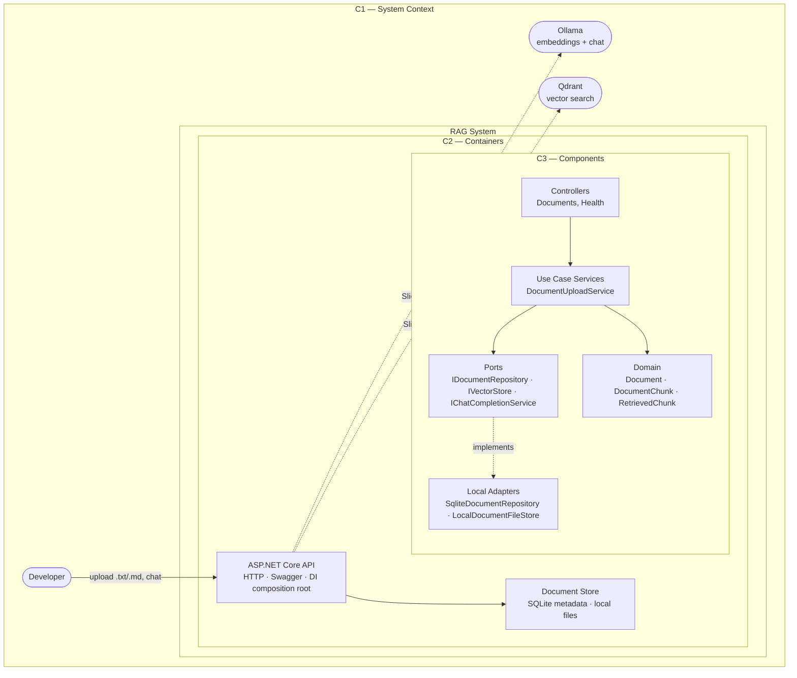

# Architecture Overview

## Purpose

A production-oriented RAG reference implementation in .NET 10. Milestone 1 runs entirely on a developer machine. Milestone 2 swaps local infrastructure for Azure services without changing Domain or Application layers.

When retrieval returns no relevant context, the system refuses to fabricate an answer.

## C4 Model (Levels 1–3)



| Level | What it shows |
|-------|---------------|
| **C1 — System Context** | Who uses the system and which external services it depends on |
| **C2 — Containers** | Deployable runtime units inside the system boundary |
| **C3 — Components** | Clean Architecture structure inside the API container |

Dashed arrows (`-.->`) mark dependencies planned in upcoming slices. Solid arrows are implemented today.

## Dependency rule

Project references point inward only. **Application never references Infrastructure.**

```text
Api → Application, Infrastructure.Local     (composition root wires both)
Infrastructure.Local → Infrastructure, Application
Infrastructure → Application
Application → Domain
Domain → (nothing)
```

| Project | May reference | Must not reference |
|---------|---------------|-------------------|
| `Rag.Domain` | — | anything |
| `Rag.Application` | `Domain` | `Infrastructure`, `Api` |
| `Rag.Infrastructure` | `Application` | `Api`, `Infrastructure.Local` |
| `Rag.Infrastructure.Local` | `Infrastructure`, `Application` | `Api` |
| `Rag.Api` | `Application`, `Infrastructure.Local` | — (composition root) |

At runtime, use cases depend on **ports** (`IDocumentRepository`). The Api registers **adapters** (`SqliteDocumentRepository`) via DI — without Application knowing the concrete type.

## RAG pipeline (target state)

```text
Upload → Parse → Chunk → Embed → Vector Store
                                      ↓
Chat Query → Retrieve → Grounded LLM Response
```

## Key ports (Application abstractions)

| Port | Milestone 1 | Milestone 2 swap |
|------|---------------|------------------|
| `IDocumentRepository` | SQLite | Azure SQL / Cosmos |
| `IDocumentFileStore` | Local filesystem | Azure Blob Storage |
| `IDocumentParser` | Text / Markdown | Same interface |
| `ITextChunker` | Fixed-size chunker | Same interface |
| `IEmbeddingGenerator` | Ollama | Azure OpenAI |
| `IVectorStore` | Qdrant | Azure AI Search |
| `IChatCompletionService` | Ollama | Azure OpenAI |

## Cross-cutting concerns (Api)

- Structured logging via `Microsoft.Extensions.Logging`
- `ProblemDetails` for consistent error responses
- Health checks at `/health`
- Swagger UI in Development
