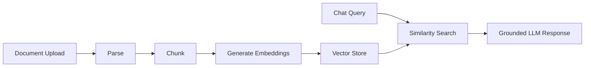

# Architecture Overview

## Purpose

This system demonstrates a RAG pipeline—upload documents, parse and chunk them, generate embeddings, store vectors locally, retrieve relevant context, and answer questions grounded in that context.

Milestone 1 is fully local. Milestone 2 replaces infrastructure adapters (embeddings, vector store, chat) with Azure equivalents while keeping Domain and Application unchanged.

## Layer responsibilities

| Layer | Responsibility |
|-------|----------------|
| **Domain** | Core concepts: `Document`, `DocumentChunk`, `RetrievedChunk` |
| **Application** | Ports (interfaces) and use-case orchestration |
| **Infrastructure** | Shared infrastructure building blocks |
| **Infrastructure.Local** | Milestone 1 adapters (Ollama, local vector store, file storage) |
| **Api** | HTTP surface, DI composition root, cross-cutting concerns |

## Dependency rule

Dependencies point inward only:

```text
Api → Application, Infrastructure.Local
Infrastructure.Local → Application, Infrastructure
Application → Domain
Domain → (nothing)
```

## RAG pipeline (target state)



When retrieval returns no relevant chunks above threshold, the system refuses to fabricate an answer.

## Key ports (Application abstractions)

- `IDocumentRepository` – document metadata persistence (SQLite in Milestone 1)
- `IDocumentFileStore` – raw uploaded file storage (local filesystem)
- `IDocumentParser` – extract text from uploaded files
- `ITextChunker` – split text into retrieval units
- `IEmbeddingGenerator` – vectorize text
- `IVectorStore` – index and search embeddings
- `IChatCompletionService` – LLM completion

Milestone 2 swaps `Infrastructure.Local` implementations for Azure-backed ones registered at the composition root.

## Cross-cutting concerns (Api)

- Structured logging via `Microsoft.Extensions.Logging`
- `ProblemDetails` for consistent error responses
- Health checks at `/health`
- OpenAPI in Development
